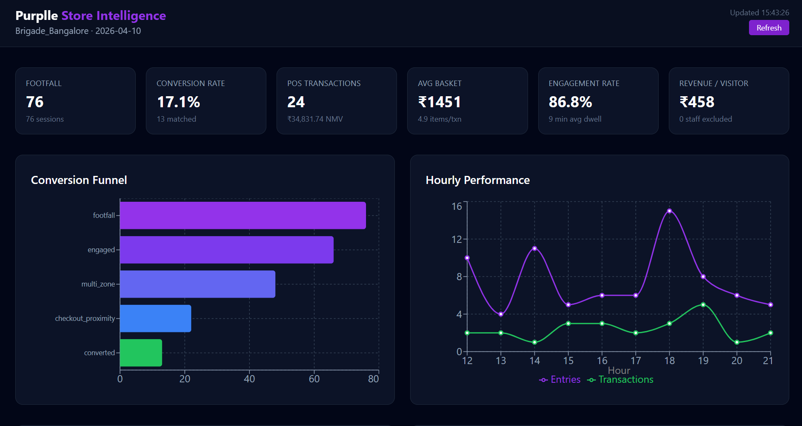
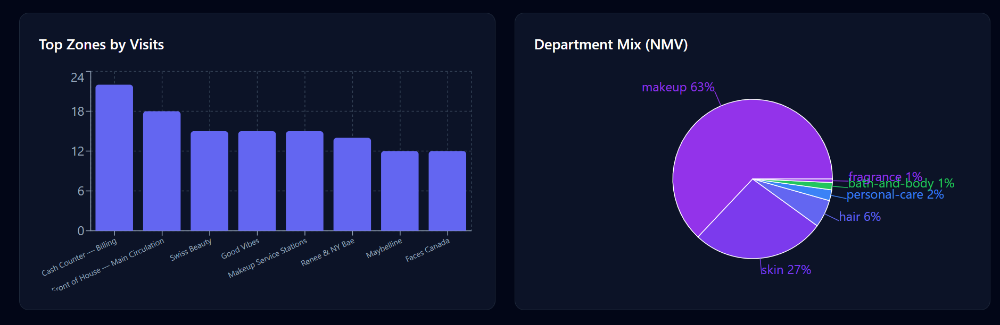
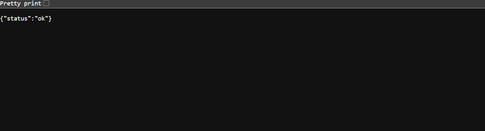
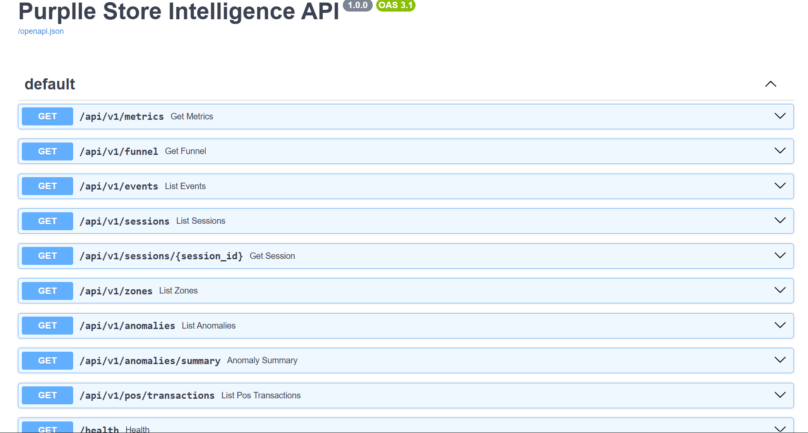

# Purplle Store Intelligence

## Project Overview

End-to-end retail analytics system that transforms CCTV video feeds into actionable business metrics — conversion rate, customer funnel, zone analytics, and anomaly detection — for Purplle store ST1008 (Brigade Bangalore).

## Architecture

```
CCTV Video → CV Pipeline (YOLOv8n + ByteTrack)
                    ↓
              Redpanda (Kafka)
                    ↓
         Analytics API (Consumer)
                    ↓
              PostgreSQL
                    ↓
         FastAPI REST + React Dashboard
```

## Tech Stack

- **CV:** YOLOv8n, ByteTrack, OpenCV
- **Backend:** Python 3.11, FastAPI, SQLAlchemy, Pydantic
- **Database:** PostgreSQL 15
- **Streaming:** Redpanda (Kafka-compatible)
- **Frontend:** React 18, TypeScript, Tailwind CSS, Recharts
- **Infrastructure:** Docker Compose

## System Components

### CV Pipeline (`services/cv-pipeline`)
- YOLOv8n for person detection (class 0)
- ByteTrack for multi-object tracking via Ultralytics
- OpenCV for video frame decoding
- Zone engine loads polygons from `config/zones/zones.yaml`
- Event builder state machine: entry/exit line crossing, zone enter/exit/dwell, staff classification
- Kafka producer publishes to `store.tracking.raw`
- Simulation fallback when no video file is present — generates POS-correlated events

### Analytics API (`services/analytics-api`)
- FastAPI REST endpoints: `/metrics`, `/funnel`, `/events`, `/sessions`, `/zones`, `/anomalies`, `/pos/transactions`
- SQLAlchemy ORM with PostgreSQL persistence
- Kafka consumer (background thread) processes tracking events
- Session engine groups events into visit sessions with re-entry and staff handling
- POS correlator matches checkout dwell to ground truth transaction timestamps
- Anomaly detector flags conversion drops, unmatched POS, loitering, staff zone violations

### Frontend (`services/frontend`)
- React + TypeScript dashboard
- Recharts for funnel, hourly trends, zone visits, department pie chart
- Auto-refresh every 15 seconds

### Infrastructure
- PostgreSQL 15 — persistent storage
- Redpanda — Kafka-compatible event bus
- Docker Compose — single-command deployment

## Detection & Tracking Pipeline

The CV pipeline processes CCTV footage to detect and track customers:

1. **Person Detection**: YOLOv8n detects persons (class 0) with confidence threshold 0.35
2. **Multi-Object Tracking**: ByteTrack maintains consistent track IDs across frames using Kalman filtering
3. **Foot-Point Centroid**: Calculates foot-point centroid for overhead CCTV mapping to zones
4. **Zone Mapping**: Maps centroids to zone polygons defined in `config/zones/zones.yaml`
5. **Event Generation**: State machine generates entry, exit, zone transitions, and staff classification events
6. **Kafka Publishing**: Structured events published to `store.tracking.raw` topic

**Edge Case Handling:**
- Confidence-based filtering (configurable threshold: 0.3)
- Re-entry handling with 120-second cooldown
- Staff classification via dwell in staff zones (30 frames threshold)
- Track loss timeout with 5-second recovery window
- Debounce frames for line crossing to prevent false positives

## Event Streaming Architecture

### Kafka Topics
- `store.tracking.raw` — Raw tracking events from CV pipeline
- `store.tracking.session` — Session-level events
- `store.anomalies` — Anomaly events
- `store.tracking.dlq` — Dead letter queue for failed events

### Event Schema
```json
{
  "event_id": "uuid",
  "timestamp": "2026-04-10T12:00:00Z",
  "person_id": "42",
  "event_type": "entry|exit|re_entry|zone_enter|zone_exit|dwell|staff_classified",
  "zone_id": "ENTRY_GATE",
  "metadata": {
    "store_id": "ST1008",
    "camera_id": "cam_foh_main",
    "frame_index": 120,
    "video_time_sec": 4.8,
    "confidence": 0.91
  }
}
```

### Kafka Consumer Features
- Background thread consumption
- Dead letter queue for failed events
- Exponential backoff for connection retries (1s, 2s, 4s, 8s, 16s, capped at 30s)
- Configurable retry attempts (default: 5)
- Event persistence to database
- Session engine integration

## Database Design

| Table | Purpose |
|---|---|
| `stores` | Store metadata |
| `zones` | Zone definitions from YAML |
| `tracking_events` | Append-only event log |
| `visit_sessions` | Customer visit sessions |
| `session_zone_visits` | Per-zone dwell within sessions |
| `pos_transactions` | Ground truth POS data |
| `pos_line_items` | SKU-level line items |
| `anomalies` | Detected anomalies |
| `daily_metrics` | Materialized daily aggregates |

### Session Model
- Session starts on `store.entry` (customer only)
- Re-entry within 120s resumes same session
- Re-entry after 120s creates new session
- Session ends on `store.exit` or 30min timeout
- Staff tracks excluded from footfall after classification

### Funnel Stages
1. **footfall** — valid entry
2. **engaged** — ≥60s product zone dwell
3. **multi_zone** — ≥2 distinct zones
4. **checkout_proximity** — CHECKOUT dwell ≥15s
5. **converted** — POS transaction matched

## API Endpoints

| Endpoint | Method | Description |
|---|---|---|
| `/health` | GET | Liveness check |
| `/ready` | GET | Readiness (DB, Kafka, consumer status) |
| `/api/v1/metrics` | GET | Store metrics with filters |
| `/api/v1/funnel` | GET | Conversion funnel stages |
| `/api/v1/events` | GET | Event log with pagination |
| `/api/v1/sessions` | GET | Session list with pagination |
| `/api/v1/sessions/{id}` | GET | Session detail |
| `/api/v1/zones` | GET | Zone definitions |
| `/api/v1/anomalies` | GET | Anomaly feed |
| `/api/v1/anomalies/summary` | GET | Anomaly summary |
| `/api/v1/pos/transactions` | GET | POS transactions |

### Metrics Available
- Footfall, engagement, conversion, revenue
- Hourly performance breakdown
- Top zones by visits
- Department mix from POS
- Funnel stage distribution

## Dashboard Features

### KPI Cards
- Total footfall
- Engagement rate
- Conversion rate
- Total revenue

### Visualizations
- Funnel chart (conversion stages)
- Hourly trends line chart
- Zone visits bar chart
- Department mix pie chart
- Anomaly feed with severity badges

### Auto-Refresh
- 15-second polling interval
- Real-time updates without page reload

## Setup Instructions

### Prerequisites
- Docker and Docker Compose installed
- 8GB RAM minimum
- 20GB disk space

### Quick Start

```bash
# 1. Copy environment configuration
cp .env.example .env
Update DATABASE_URL and PostgreSQL credentials in .env before starting the system.

# 2. Update database password (IMPORTANT)
# Edit .env and replace CHANGE_ME_STRONG_PASSWORD with a strong password
# Also update docker-compose.yml POSTGRES_PASSWORD with the same password

# 3. Start all services
docker compose up --build
```

### Startup Verification

```bash
# Check health endpoint
curl http://localhost:8000/health

# Check readiness (includes DB, Kafka, consumer status)
curl http://localhost:8000/ready

# Check metrics API
curl http://localhost:8000/api/v1/metrics
```

## Running with Docker

### Services
1. **postgres** — PostgreSQL 15-alpine
2. **redpanda** — Kafka-compatible event bus
3. **init-seed** — One-shot database initialization
4. **cv-pipeline** — One-time video processing
5. **analytics-api** — FastAPI server
6. **frontend** — React + Nginx

### Startup Order
postgres → redpanda → init-seed → cv-pipeline → analytics-api → frontend

### Health Checks
- PostgreSQL: `pg_isready`
- Redpanda: `rpk cluster health`
- Analytics API: `curl -f http://localhost:8000/health`

### CCTV Video Input

Place footage in `cctv_footage/` directory (auto-mounted in Docker). If no video is found, the pipeline runs a POS-correlated simulation.

### Access URLs
- **Dashboard:** http://localhost:3000
- **API Docs:** http://localhost:8000/docs
- **API:** http://localhost:8000
- **Health:** http://localhost:8000/health

### Stop Services
```bash
docker compose down
```

### Clean Restart
```bash
docker compose down -v
docker compose up --build
```

# Future Improvements

- Multi-store deployment support
- Cross-camera customer re-identification
- GPU-accelerated inference for real-time processing
- Role-based authentication and access control
- Prometheus and Grafana monitoring stack
- Advanced ML-based anomaly detection
- Cloud-native deployment support
- Real-time alerting and notifications
- Multi-branch analytics dashboard

# Screenshots

## Store Intelligence Dashboard

Shows footfall, conversion rate, engagement metrics, revenue analytics, funnel analysis and anomaly monitoring.



---

## Analytics Dashboard

Zone-wise visit distribution and department-level revenue mix.



---

## API Health Check

Analytics API health endpoint verification.



---

## Interactive API Documentation

Swagger/OpenAPI documentation exposing analytics endpoints.

